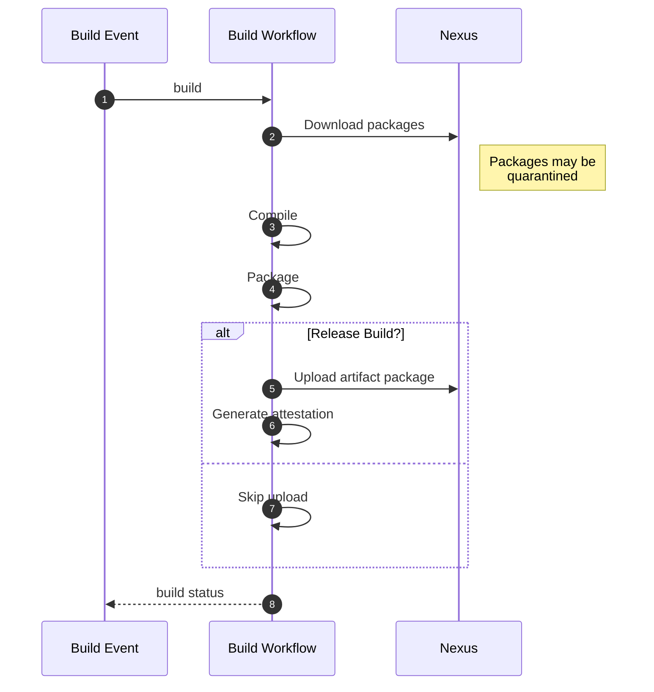
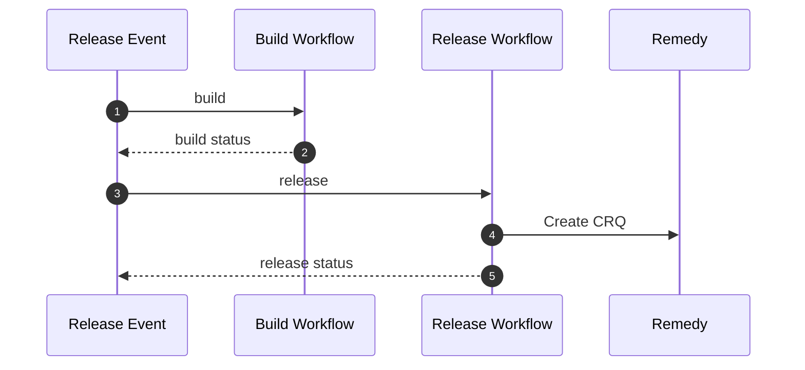
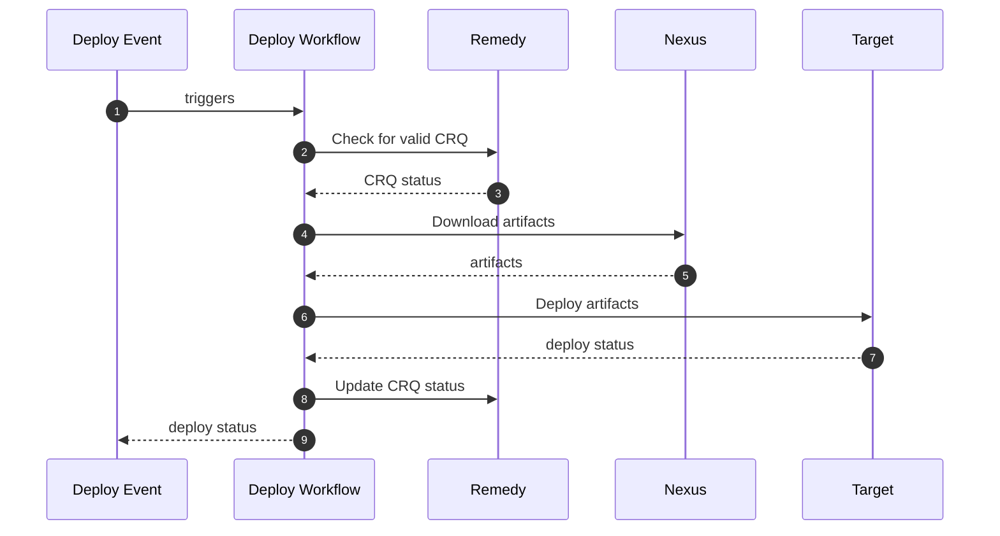
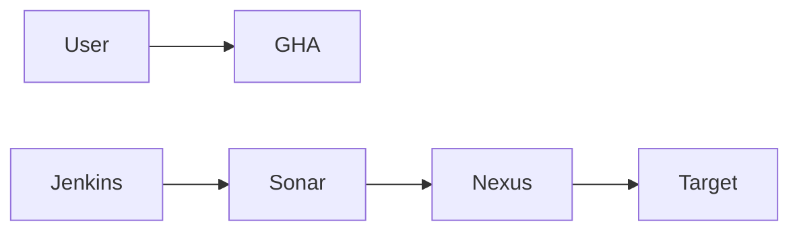

# Build

```mermaid
sequenceDiagram
    autonumber
    participant Build Event
    participant Build Workflow
    participant Nexus

    Build Event->>Build Workflow: build
    Build Workflow->>Nexus: Download packages
    Note right of Nexus: Packages may be<br/>quarantined
    Build Workflow->>Build Workflow: Compile
    Build Workflow->>Build Workflow: Package
    alt Release Build?
        Build Workflow->>Nexus: Upload artifact package
        Build Workflow->>Build Workflow: Generate attestation
    else
        Build Workflow->>Build Workflow: Skip upload
    end
    Build Workflow-->>Build Event: build status
```

# Release

```mermaid
sequenceDiagram
    autonumber
    participant Release Event
    participant Build Workflow
    participant Release Workflow
    participant Remedy

    Release Event->>Build Workflow: build
    Build Workflow-->>Release Event: build status
    Release Event->>Release Workflow: release
    Release Workflow->>Remedy: Create CRQ
    Release Workflow-->>Release Event: release status
```

# Deploy

```mermaid
sequenceDiagram
    autonumber
    participant Deploy Event
    participant Deploy Workflow
    participant Remedy
    participant Nexus
    participant Target

    Deploy Event->>Deploy Workflow: triggers
    Deploy Workflow->>Remedy: Check for valid CRQ
    Remedy-->>Deploy Workflow: CRQ status
    Deploy Workflow->>Nexus: Download artifacts
    Nexus-->>Deploy Workflow: artifacts
    Deploy Workflow->>Target: Deploy artifacts
    Target-->>Deploy Workflow: deploy status
    Deploy Workflow->>Remedy: Update CRQ status
    Deploy Workflow-->>Deploy Event: deploy status
```

# Workflow

```mermaid
graph LR
    User --> GHA
    Jenkins --> Sonar
    Sonar --> Nexus
    Nexus --> Target
```
