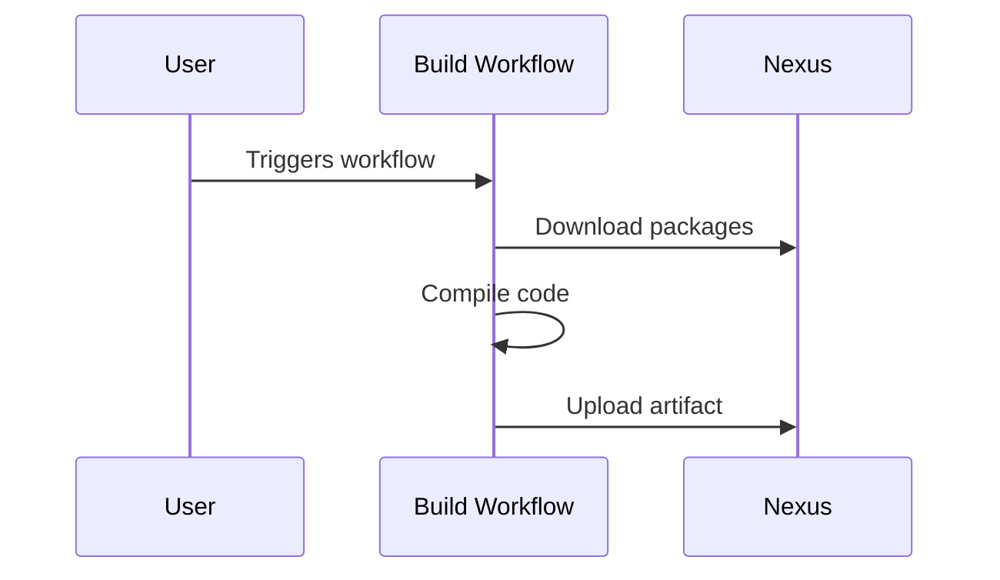
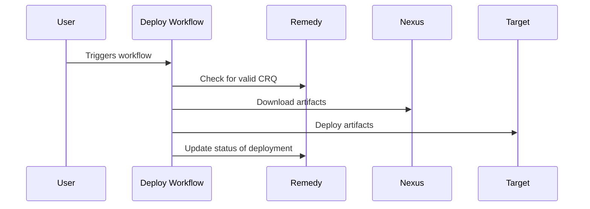

# Build



```mermaid
```

# Release

```mermaid
sequenceDiagram
    participant User
    participant Release Workflow
    participant Remedy
    participant Nexus

    User->>Release Workflow: Triggers workflow
    Release Workflow->>Release Workflow: Build artifacts
    Release Workflow->>Remedy: Create CRQ
    Release Workflow->>Nexus: Upload artifacts
```

# Deploy


