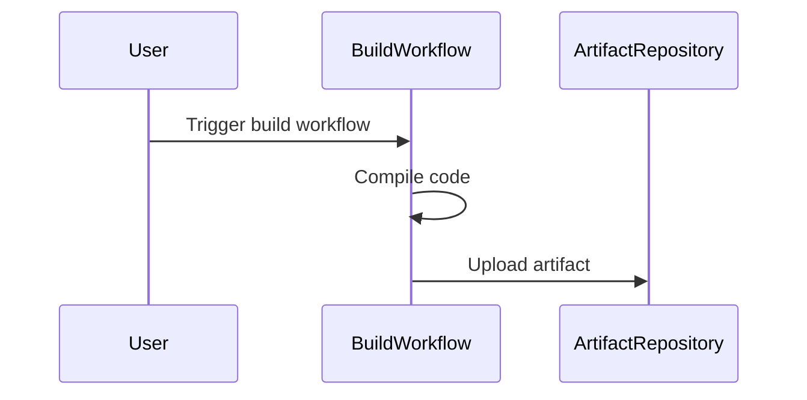
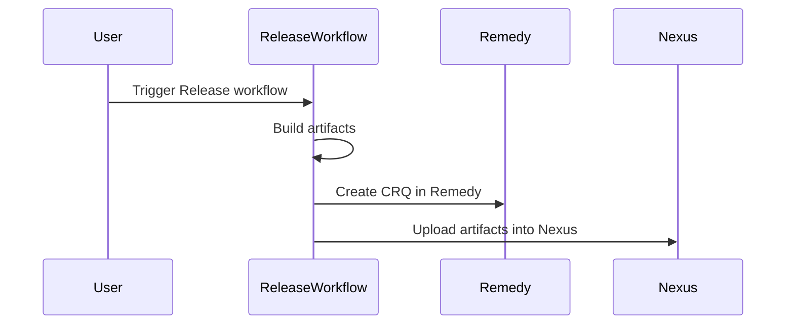
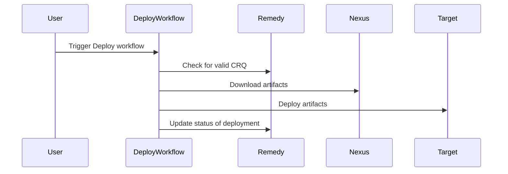

# Build

```mermaid
sequenceDiagram
    participant User
    participant BuildWorkflow
    participant ArtifactRepository

    User->>BuildWorkflow: Trigger build workflow
    BuildWorkflow->>BuildWorkflow: Compile code
    BuildWorkflow->>ArtifactRepository: Upload artifact
```

# Release

```mermaid
sequenceDiagram
    participant User
    participant ReleaseWorkflow
    participant Remedy
    participant Nexus

    User->>ReleaseWorkflow: Trigger Release workflow
    ReleaseWorkflow->>ReleaseWorkflow: Build artifacts
    ReleaseWorkflow->>Remedy: Create CRQ in Remedy
    ReleaseWorkflow->>Nexus: Upload artifacts into Nexus
```

# Deploy

```mermaid
sequenceDiagram
    participant User
    participant DeployWorkflow
    participant Remedy
    participant Nexus
    participant Target

    User->>DeployWorkflow: Trigger Deploy workflow
    DeployWorkflow->>Remedy: Check for valid CRQ
    DeployWorkflow->>Nexus: Download artifacts
    DeployWorkflow->>Target: Deploy artifacts
    DeployWorkflow->>Remedy: Update status of deployment
```
