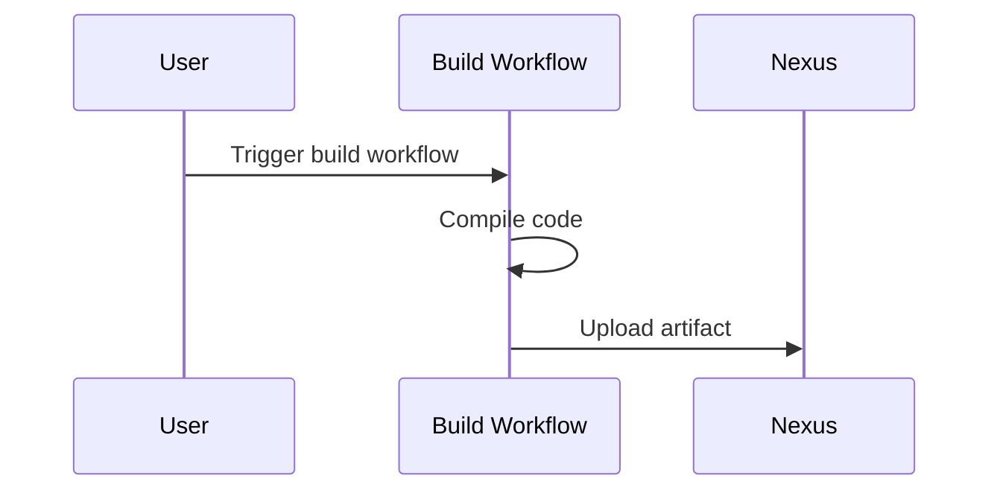
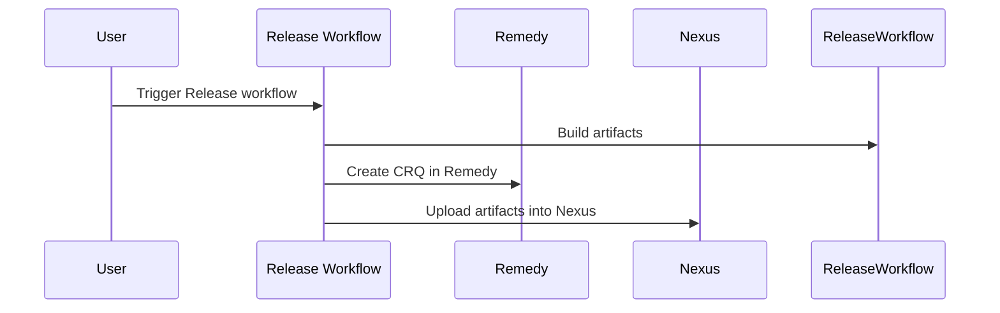
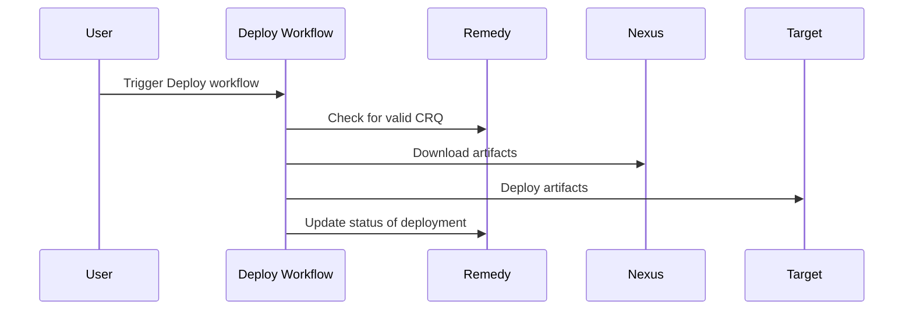

# Build

```mermaid
sequenceDiagram
    participant User
    participant Build Workflow
    participant Nexus

    User->>Build Workflow: Trigger build workflow
    Build Workflow->>Build Workflow: Compile code
    Build Workflow->>Nexus: Upload artifact
```

# Release

```mermaid
sequenceDiagram
    participant User
    participant Release Workflow
    participant Remedy
    participant Nexus

    User->>Release Workflow: Trigger Release workflow
    Release Workflow->>ReleaseWorkflow: Build artifacts
    Release Workflow->>Remedy: Create CRQ in Remedy
    Release Workflow->>Nexus: Upload artifacts into Nexus
```

# Deploy

```mermaid
sequenceDiagram
    participant User
    participant Deploy Workflow
    participant Remedy
    participant Nexus
    participant Target

    User->>Deploy Workflow: Trigger Deploy workflow
    Deploy Workflow->>Remedy: Check for valid CRQ
    Deploy Workflow->>Nexus: Download artifacts
    Deploy Workflow->>Target: Deploy artifacts
    Deploy Workflow->>Remedy: Update status of deployment
```
